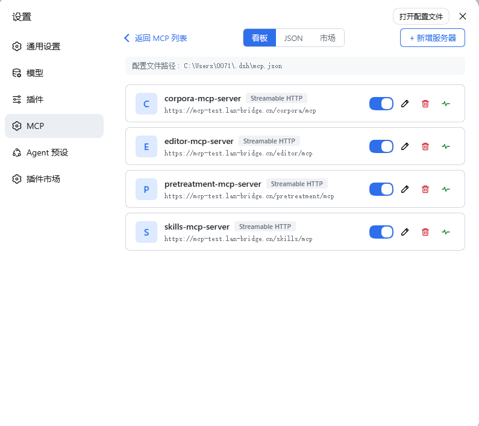

# MCP-Manger

English | [中文](README.zh.md)

`@mcp-manger/mcp-manager` — a **dual-face Model Context Protocol manager plugin** for [deepseek-harness](https://github.com/deepseek-ai/deepseek-harness) (dsh, built on [Cordis](https://cordis.js.org)). Single package, two entry points, one composition row: the Host half supervises any number of MCP servers, while the browser half renders a service management panel and a JSON configuration editor.
Complete the configuration of MCP-Server through configuration files (similar to the approach of WorkBuddy)


## Version compatibility

`@deepseek-ai/dsh-*` `0.1.5-rc.2` lockstep line or newer (see `package.json` peer dependencies).

## Quick start

```sh
dsh plugin --profile web add @mcp-manger/mcp-manager
```

Restart `dsh web`, then open **Settings → MCP**. The install auto-inserts the composition row; the panel appears as its own sidebar entry.

## Architecture

One npm package exposes two entry points:

| Entry | Plane | Responsibility |
|---|---|---|
| `.` | Host (Node) | Supervises MCP connections from `~/.dsh/mcp.json` (stdio / streamable-http, tool discovery, auto-reconnect); exposes the `mcp` Remote namespace. |
| `./client` | Client (web) | MCP service panel + JSON configuration editor, injected into `settings.section`. |

**Host face**: `McpRegistry` (extends `TypertRemoteService`) layers entry config over `mcp.json` user config, then hands the result to an internal `ServerSupervisor` — one connection per server, re-creating only what changed. Tools register under `mcp__<serverName>__` on `ctx.tools`.

**Client face**: `apply` self-mounts the `mcp` Remote namespace, creates a `McpManagerController`, and injects the panel into `settings.section`. All RPC calls are serialized on a single queue to prevent concurrent answer clobbering.

## License

MIT
