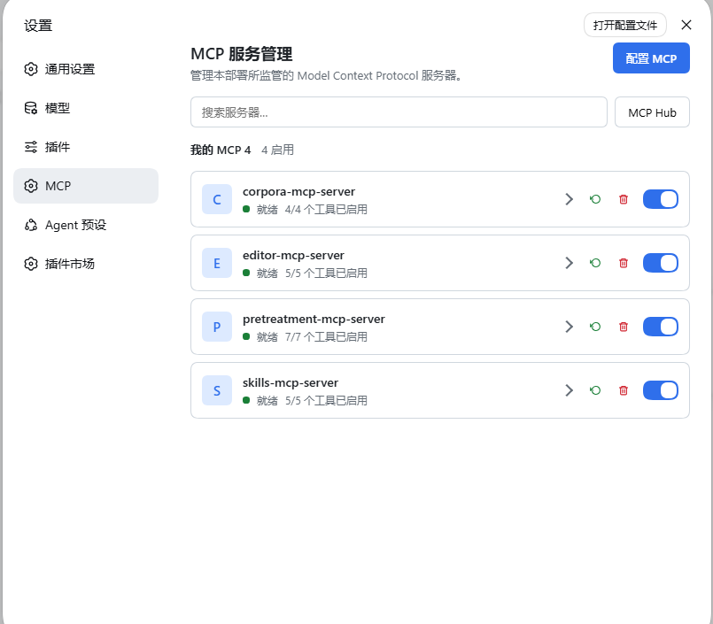
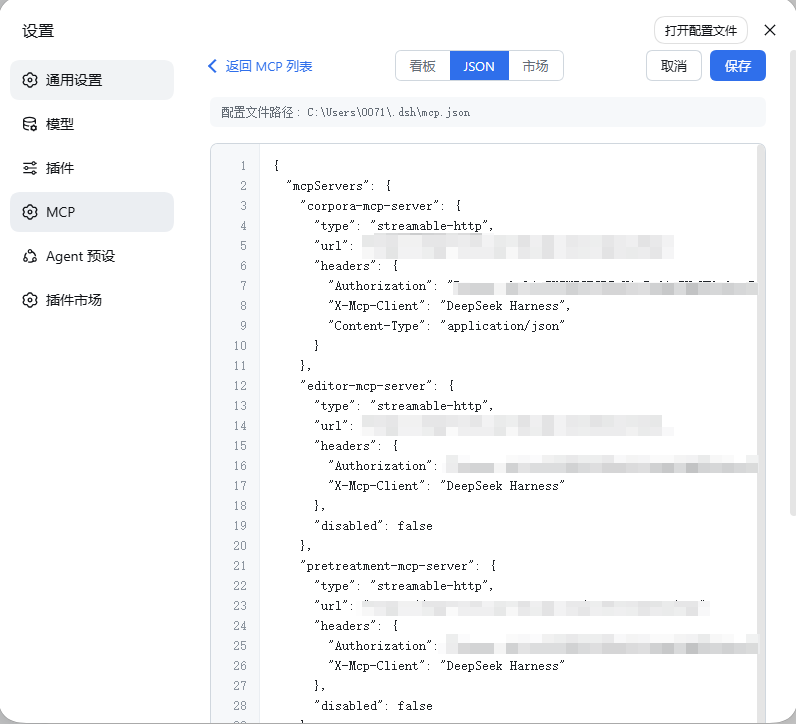
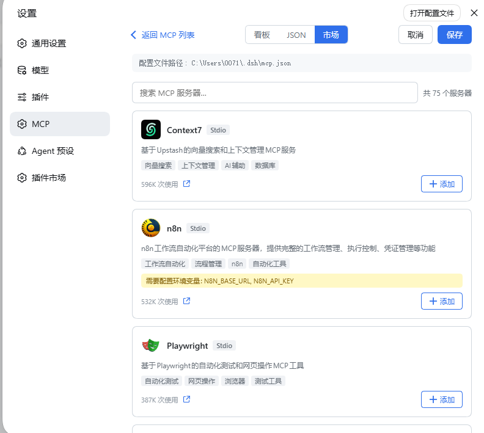
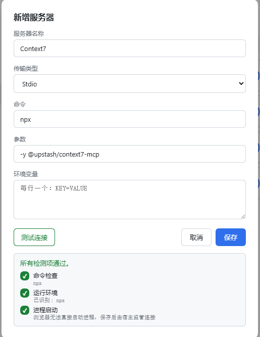

# MCP-Manager

[English](README.md) | 中文

`@mcp-manager/mcp-manager` —— 面向 [deepseek-harness](https://github.com/deepseek-ai/deepseek-harness)（dsh，基于 [Cordis](https://cordis.js.org)）的**双面 Model Context Protocol 管理插件**。单包、双入口、一行组合：宿主侧监管任意数量的 MCP 服务器，浏览器侧呈现服务管理面板与 JSON 配置编辑器。







## 功能特性

- **看板视图**：卡片式 UI，一键新增、编辑、管理 MCP 服务器
- **JSON 视图**：直接编辑 JSON 配置文件，适合高级用户
- **MCP 市场**：从 [mcp-cn.com](https://www.mcp-cn.com/) 浏览并一键安装热门 MCP 服务器
- **连接测试**：保存前可测试服务器连接，展示逐步检测结果
- **健康检测**：每个服务器的健康监控，输出详细诊断信息
- **多传输协议**：支持 stdio、HTTP、SSE、Streamable HTTP
- **请求头编辑器**：Postman 风格的行式请求头编辑器
- **删除确认**：两步确认防止误删
- **宿主侧 HTTP 代理**：市场 API 请求通过 Node.js 转发，绕过浏览器 CORS 限制

## 版本适配

`@deepseek-ai/dsh-*` `0.1.5-rc.2` 同版本线或更新（见 `package.json` 对等依赖）。

## 快速开始

```sh
dsh plugin --profile web add @mcp-manager/mcp-manager
```

重启 `dsh web`，打开 **设置 → MCP**。安装时自动插入组合行，面板作为独立侧边栏条目出现。

## 使用说明

### 列表视图

默认视图展示所有已配置的 MCP 服务器及其实时状态（连接中 / 就绪 / 失败 / 已停用）、工具数量和快捷操作：

- **展开**：显示/隐藏服务器已注册的工具
- **重启**：重新连接服务器
- **删除**：移除服务器（需二次确认）
- **启用/停用**：切换服务器开关

### 看板视图

点击 **“配置 MCP”** 进入看板视图。每个服务器渲染为一张卡片，包含：

- 启用/停用开关
- 编辑（铅笔）按钮
- 删除（垃圾桶）按钮，带两步确认
- 健康检测（脉冲）按钮

点击 **“+ 新增服务器”** 创建新条目。表单支持：

- 传输类型选择（stdio / HTTP / SSE / Streamable HTTP）
- stdio 类型的命令 + 参数
- HTTP 类型的 URL + 请求头
- 环境变量（每行一个）
- **测试连接** 按钮，保存前验证服务器可用性

### JSON 视图

切换到 JSON 标签页，直接编辑 `mcp.json` 配置。

### 市场

切换到市场标签页，浏览 [mcp-cn.com](https://www.mcp-cn.com/) 的热门 MCP 服务器。功能包括：

- 关键词搜索
- 无限滚动分页
- 服务器 Logo、标签和使用次数
- 一键添加，自动预填看板表单

## 架构

同一个 npm 包暴露两个入口：

| 入口 | 平面 | 职责 |
|---|---|---|
| `.` | 宿主（Node） | 从 `~/.dsh/mcp.json` 监管 MCP 连接（stdio / http / sse / streamable-http、工具发现与调用、自动重连）；暴露 `mcp` Remote 命名空间，包含用于无 CORS 限制的市场 API 访问的 `fetchMarket` 方法。 |
| `./client` | 客户端（web） | MCP 服务管理面板 + 看板视图 + JSON 编辑器 + 市场浏览器，注入 `settings.section`。 |

**宿主面**：`McpRegistry`（继承 `TypertRemoteService`）把入口配置叠加在 `mcp.json` 用户配置之上，交给内部 `ServerSupervisor` 监管——每个服务器一条连接，只重建变化的部分。工具注册在 `ctx.tools` 的 `mcp__<serverName>__` 命名空间下。`fetchMarket` 方法代理客户端的 HTTP 请求，避免浏览器 CORS 限制。

**客户端面**：`apply` 自挂载 `mcp` Remote 命名空间，创建 `McpManagerController`，将面板注入 `settings.section`。所有 RPC 调用串行化在一条 queue 上，避免并发答案互相覆盖。

## 许可

MIT
